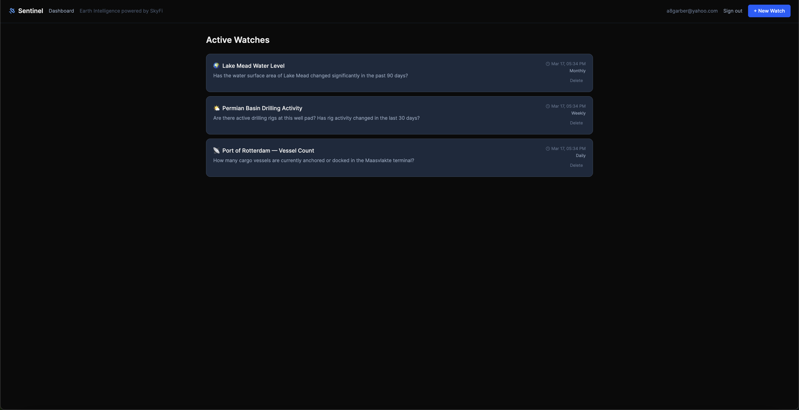
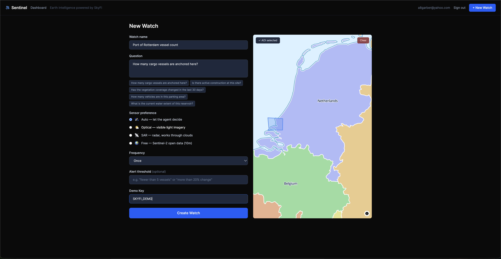
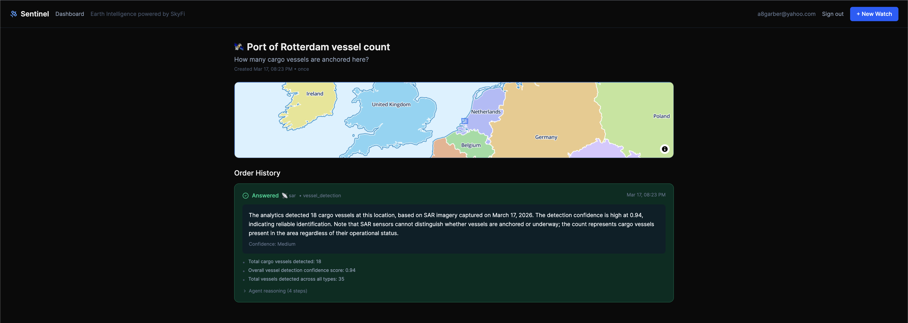
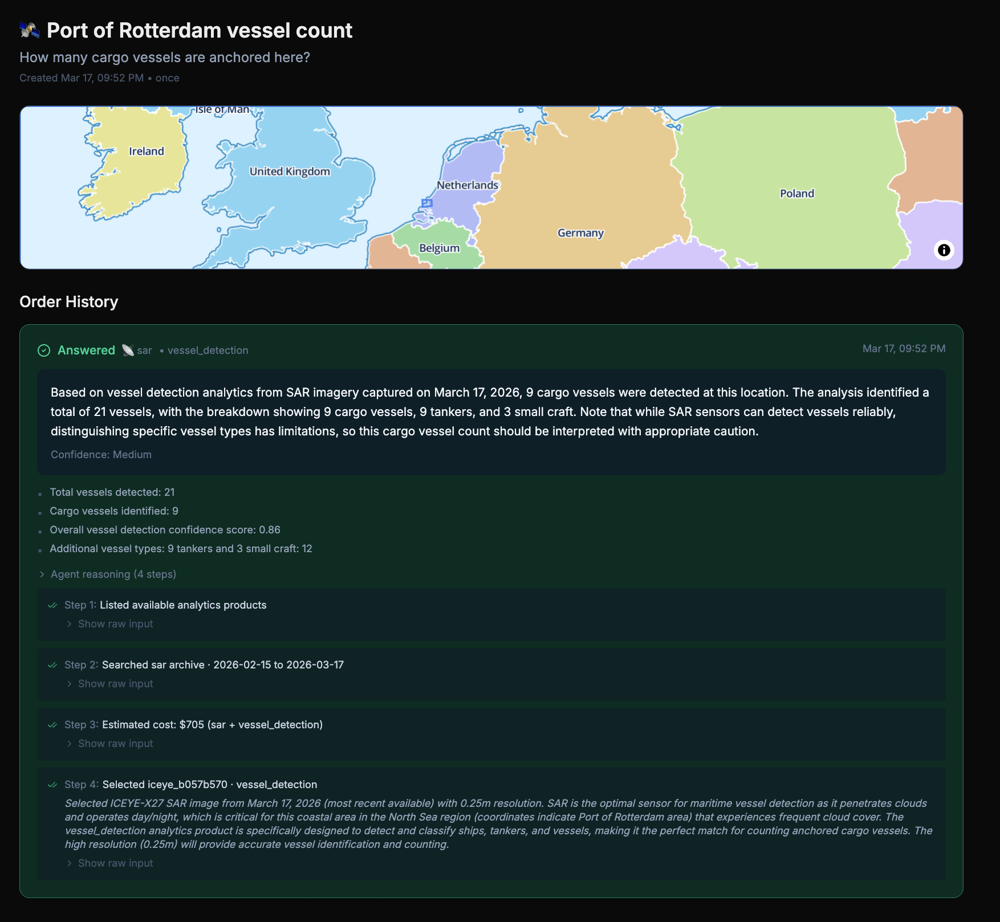

# Sentinel 🛰️

> *Ask any question about any place on Earth. Get an answer, not an image.*

Sentinel is an autonomous Earth intelligence agent that wraps SkyFi's geospatial platform API. Draw an area of interest, ask a natural-language question, and an AI agent autonomously selects satellite data products, places orders, and returns a plain-English answer.

---

### Screenshots


*Dashboard*


*Creating a watch with AOI polygon*


*Watch detail with answered order*


*Agent reasoning steps*

---

## How it works

The user draws a polygon on an interactive map, names the watch, and types a natural-language question — for example, "How many cargo vessels are anchored in this harbor?" The AI agent first lists the available SkyFi analytics products, then searches the satellite archive for the most appropriate recent imagery over that area, selecting optical or SAR based on the question type and cloud cover conditions. After estimating cost and placing the order via the SkyFi REST API, a RabbitMQ worker polls for delivery and — once the order is complete — passes the raw analytics output to Claude, which interprets the numbers and writes a plain-English answer with supporting evidence. The answer appears in the browser in real-time via Server-Sent Events. The core insight: imagery is a commodity; answers are the product.

---

## Tech stack

| Layer | Technology | Role |
|---|---|---|
| Frontend | Next.js 14 + React + TypeScript + Tailwind + MapLibre GL | Interactive map, polygon draw, watch management, real-time results |
| Backend | FastAPI + Python 3.11 | Agent orchestration, SkyFi API client, SSE endpoint, webhook receiver |
| AI Agent | Claude API (tool-use loop) | Question → sensor selection → order placement → analytics interpretation |
| Database | PostgreSQL 15 + PostGIS | Watches, orders, geospatial AOIs, per-user data isolation |
| Messaging | RabbitMQ | Async order lifecycle (satellite delivery is never instant) |
| Infrastructure | Docker + Kubernetes + Helm | Local compose stack, production K8s manifests for GKE and EKS |

---

## SkyFi API integration

Sentinel uses the following SkyFi platform capabilities:

- **Archive search** — query available imagery by AOI, date range, sensor type, and resolution
- **Satellite tasking** — request new captures when archive imagery is insufficient
- **Order placement** — transactional imagery purchasing via the platform REST API
- **Analytics products** — vehicle detection, vessel detection, change detection, water surface extent, oil tank inventory, building footprint extraction
- **Satellite pass prediction** — estimate when the next suitable asset will overfly an AOI
- **Open data (Sentinel-2)** — free 10 m imagery for large-area or budget-constrained watches
- **Webhooks** — order completion callbacks that drive the async worker pipeline

By default, Sentinel runs in **mock mode**: all SkyFi API calls are handled by a local mock that simulates realistic delivery delays and returns plausible analytics data, so the full end-to-end flow works without a SkyFi account. To run against the real SkyFi platform, set `SKYFI_API_KEY` in your environment — no other changes are required.

---

## Local development

```bash
git clone https://github.com/OldEphraim/sentinel.git
cd sentinel
cp .env.example .env
# Edit .env: set ANTHROPIC_API_KEY and SECRET_KEY (openssl rand -hex 32)
# Leave SKYFI_API_KEY empty to use mock mode
docker compose up --build
```

Visit **http://localhost:3000**, click **Create Account**, and enter the demo key **`SKYFI_DEMO`**. Three demo watches are automatically created for your account and the agent runs immediately.

Other services:
- API + docs: http://localhost:8000/docs
- RabbitMQ management: http://localhost:15672
- Postgres: localhost:5432

To seed additional demo watches manually:

```bash
uv run --with httpx python scripts/seed.py
```

---

## Demo key

Creating an account requires a demo key to prevent unauthorized use of the Anthropic API. The default key is `SKYFI_DEMO`. To use a different key, set the `DEMO_KEY` environment variable before starting the API container. The key is checked at signup and at watch creation.

---

## Architecture

```
┌─────────────────────────────────────────────────────────────┐
│                        Browser                              │
│  Next.js frontend: map, polygon draw, watch list, results   │
└──────────────────────────┬──────────────────────────────────┘
                           │ REST + SSE
┌──────────────────────────▼──────────────────────────────────┐
│                   FastAPI (Python 3.11)                     │
│  - Auth (JWT) · Watch CRUD · Agent orchestration            │
│  - SkyFi REST client · Webhook receiver · SSE stream        │
└──────────┬──────────────────────────────────┬───────────────┘
           │ publishes                         │ reads/writes
┌──────────▼──────────┐           ┌───────────▼───────────────┐
│     RabbitMQ        │           │   PostgreSQL + PostGIS     │
│  order.placed       │           │   watches · orders · users │
└──────────┬──────────┘           └───────────────────────────┘
           │ consumes
┌──────────▼──────────────────────────────────────────────────┐
│                  Python Worker Service                       │
│ - Polls SkyFi order status until complete                    │
│ - Calls Claude to interpret analytics → plain-English answer │
│ - Writes result to Postgres (frontend polling detects change)│
└─────────────────────┬───────────────────────────────────────┘
                      │ tool-use calls
           ┌──────────▼──────────┐
           │  Claude API         │  SkyFi Platform API
           │  (Anthropic)        │  (app.skyfi.com)
           └─────────────────────┘
```

---

## Production deployment

Kubernetes manifests are in `k8s/`. A Helm chart is in `helm/sentinel/` with environment-specific values files for GKE (`values.gke.yaml`) and EKS (`values.eks.yaml`).

---

## About

Built by Alan (OldEphraim) during Gauntlet AI Week 5 — an elite AI engineering cohort in Austin, Texas run by Austen Allred. Sentinel is not affiliated with or endorsed by SkyFi.

---

*"There is no and will never be a 'contact sales' button on SkyFi." — Luke Fischer, CEO*
